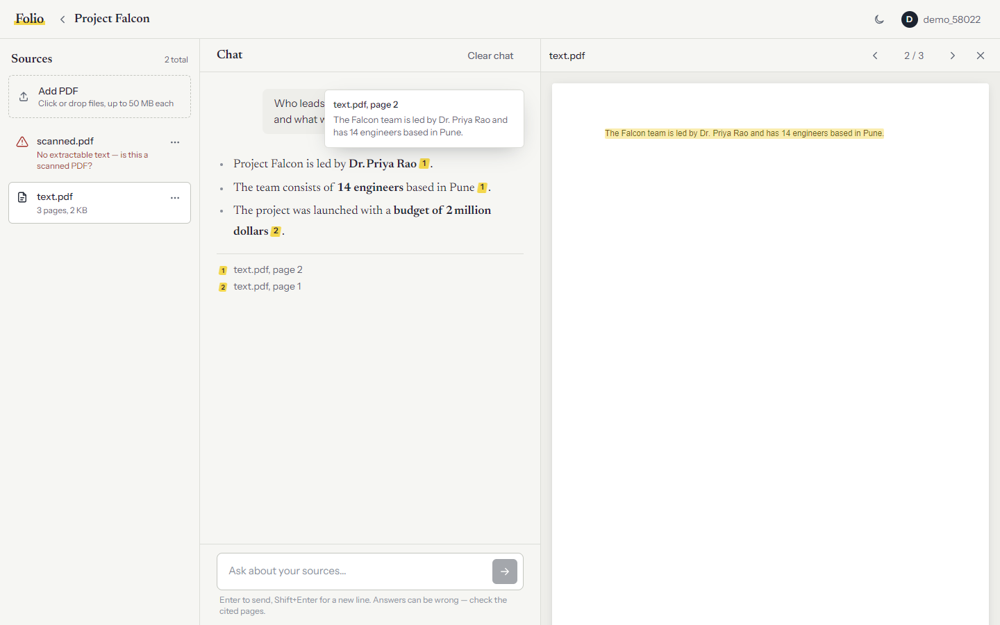

# Folio

Folio is a NotebookLM-style app for asking questions about your own PDFs. You
upload documents into a notebook, ask questions in a chat, and every claim in
the answer is marked with a citation. Clicking a citation opens the PDF at the
cited page with the supporting passage highlighted.

It is a full-stack retrieval-augmented generation (RAG) application: a FastAPI
backend with Postgres/pgvector, a React frontend, and a free LLM (Groq), all
started with one `docker compose up`.



## Features

- **Accounts.** Username and password sign-in. Each user only sees their own
  notebooks, files and chats.
- **Notebooks.** Create, rename and delete notebooks; each holds its own set of
  sources and its own chat.
- **PDF sources.** Drag-and-drop upload (up to 50 MB each). Files are stored
  and indexed in the background, with a live "processing → ready / failed"
  status. Image-only (scanned) PDFs are detected and reported.
- **Cited answers.** Answers stream in word by word. Every claim carries a
  numbered citation; hovering shows the source snippet, clicking opens the
  page in the built-in PDF viewer with the passage highlighted.
- **Follow-up questions.** Chat history is saved per notebook and the last few
  turns are sent with each question, so "tell me more about that" works.
- **Grounded by design.** The model is instructed to answer only from the
  retrieved excerpts and to say so when they don't contain the answer.
- **Production touches.** Hashed passwords, httpOnly session cookies, login
  rate limiting, database migrations, upload validation, graceful handling of
  the LLM's free-tier rate limits, light and dark themes, and a mobile layout.

## How it works

```text
                 ┌──────────────────────── Docker Compose ───────────────────────┐
 Browser ──────► │ nginx (frontend)  ── /        → React app (static files)      │
 localhost:8080  │                   ── /api/*   → FastAPI backend ──┐           │
                 │                                                   │           │
                 │   FastAPI ── SQL + vector search ──► Postgres + pgvector      │
                 │           ── PDF files ─────────────► uploads volume          │
                 │           ── embeddings ────────────► local model (CPU)       │
                 └───────────────────────────────────────────┬───────────────────┘
                                                             └──► Groq API (LLM)
```

### Uploading a PDF

1. The backend checks the file (PDF signature, size), saves it to disk, and
   returns immediately with status `processing`.
2. A background task extracts text page by page (PyMuPDF), splits it into
   overlapping ~800-character chunks that remember their page number, and
   embeds each chunk with `BAAI/bge-small-en-v1.5` running locally.
3. Chunks and their 384-dimension vectors are stored in Postgres; the document
   becomes `ready`.

### Asking a question

1. The question is embedded with the same model and compared against the
   notebook's chunks by cosine similarity (pgvector, HNSW index). The six
   closest chunks are retrieved.
2. They're sent to the LLM labelled `[C1]…[C6]`, together with recent chat
   history and instructions to cite every claim as `[[C1]]`.
3. The answer streams back to the browser over Server-Sent Events.
4. When it finishes, the citation markers are parsed into structured sources
   (file, page, snippet), saved with the message, and rendered as clickable
   chips.

## Running it

**Requirements:** Docker Desktop, and a free Groq API key from
<https://console.groq.com/keys>.

```bash
cp .env.example .env
```

Edit `.env` and set:

- `GROQ_API_KEY` — your Groq key.
- `JWT_SECRET` — any long random string. To generate one:
  `python -c "import secrets; print(secrets.token_urlsafe(48))"`

Then:

```bash
docker compose up --build
```

Open <http://localhost:8080> and create an account.

The first build takes several minutes: it downloads CPU-only PyTorch and the
embedding model (~130 MB) into the image. After that, the app needs no
internet access except for calls to Groq.

Data persists in two Docker volumes, `pgdata` (database) and `uploads` (PDF
files). `docker compose down` keeps them; `docker compose down -v` deletes
everything.

## Development

Run the database in Docker and the app on your machine, with hot reload for the
frontend. Requires [uv](https://docs.astral.sh/uv/) and Node.js 22+.

```bash
docker compose up -d db                 # Postgres on localhost:5432
uv sync                                 # Python dependencies
uv run alembic upgrade head             # create / update tables
uv run uvicorn app.main:app --port 8000 # API on :8000

cd frontend
npm install
npm run dev                             # app on http://localhost:5173
```

Vite forwards `/api` to `http://localhost:8000`; to use another port, start it
with `API_TARGET=http://localhost:8001 npm run dev`. Interactive API docs are at
<http://localhost:8000/docs>.

After changing the database models, add a migration in `alembic/versions/`.

## Configuration

All settings come from `.env` (see `.env.example`).

| Variable | Default | Purpose |
|---|---|---|
| `GROQ_API_KEY` | — | Required. Groq key for answer generation. |
| `JWT_SECRET` | — | Required. Signs session cookies; startup fails without it. |
| `GROQ_MODEL` | `openai/gpt-oss-120b` | Chat model on Groq. |
| `POSTGRES_PASSWORD` | `ragpass` | Database password used by Docker Compose. |
| `DATABASE_URL` | localhost | Database URL when running the backend outside Docker. |
| `MAX_UPLOAD_MB` | `50` | Largest accepted PDF. |
| `COOKIE_SECURE` | `false` | Set `true` when serving over HTTPS. |
| `EMBEDDING_MODEL` / `EMBEDDING_DIM` | `BAAI/bge-small-en-v1.5` / `384` | Local embedding model. |
| `CHUNK_SIZE` / `CHUNK_OVERLAP` | `800` / `150` | Chunking, in characters. |
| `TOP_K` | `6` | Chunks retrieved per question. |
| `HISTORY_MESSAGES` | `6` | Previous messages sent for follow-up context. |

## API

All endpoints are under `/api`. Authentication is a session cookie set by
register/login. Resources owned by another user return `404`.

| Method | Path | Description |
|---|---|---|
| `POST` | `/auth/register` | Create an account and sign in |
| `POST` | `/auth/login` | Sign in (10 failed attempts per 15 min → `429`) |
| `POST` | `/auth/logout` | Sign out |
| `GET` | `/auth/me` | Current user |
| `GET` `POST` | `/notebooks` | List / create notebooks |
| `GET` `PATCH` `DELETE` | `/notebooks/{id}` | Get / rename / delete a notebook |
| `GET` `POST` | `/notebooks/{id}/documents` | List / upload PDFs |
| `GET` `DELETE` | `/documents/{id}` | Document status / delete |
| `GET` | `/documents/{id}/file` | Download the PDF |
| `GET` `DELETE` | `/notebooks/{id}/messages` | Chat history / clear chat |
| `POST` | `/notebooks/{id}/chat` | Ask a question; streams `token`, then `done` or `error` events |

## Project layout

```text
app/                     FastAPI backend
  main.py                app setup, startup tasks
  config.py              settings from .env
  models.py              User, Notebook, Document, Chunk, Message
  security.py            password hashing, session tokens, login rate limit
  deps.py                current user + ownership checks
  routers/               auth, notebooks, documents, chat
  services/
    ingest.py            background PDF processing
    pdf_parser.py        PDF → text per page
    chunking.py          text → overlapping chunks with page numbers
    embeddings.py        local sentence-transformers model
    retrieval.py         pgvector similarity search
    llm.py               prompt, Groq streaming, citation parsing
    storage.py           PDF files on disk
alembic/                 database migrations
frontend/                React + TypeScript (Vite, Tailwind, TanStack Query, react-pdf)
  src/api/               API client, SSE stream reader, data hooks
  src/pages/             sign-in, notebooks, workspace
  src/components/        sources panel, chat, PDF viewer, UI parts
  nginx.conf             serves the app and proxies /api
Dockerfile               backend image
docker-compose.yml       db + backend + frontend
```

## Design decisions

- **Local embeddings, hosted LLM.** Embedding every chunk is the high-volume
  step, so it runs locally for free; only answer generation calls Groq.
- **Citations as markers, not free text.** Numbering excerpts and requiring
  `[[Cn]]` markers turns citations into data the UI can link to a page. Models
  don't always follow the format exactly (gpt-oss prefers `【C1】`), so the
  backend and frontend both normalise variants and drop markers that don't
  match a retrieved excerpt.
- **Highlighting across parsers.** The backend extracts text with PyMuPDF and
  the browser renders it with pdf.js; their whitespace differs. The viewer
  compares text with whitespace removed to find the cited passage reliably.
- **Background processing.** Embedding a long PDF takes seconds to minutes, so
  uploads return immediately and the UI polls status. Jobs interrupted by a
  restart are marked failed on startup instead of staying "processing" forever.
- **Same-origin cookies.** nginx serves the app and proxies the API, so the
  session cookie is `httpOnly` and `SameSite=Lax` with no CORS setup.

## Limitations

- Scanned PDFs need OCR, which isn't included; they're reported as failed.
- No password reset or email verification.
- One backend process: the login rate limiter is in memory and files live on
  a local volume, so it isn't set up for multiple servers.
- One chat thread per notebook; notebooks can't be shared between users.
- Groq's free tier has rate limits; when hit, the app shows how long to wait.
